# 🛍️ CampusShop

**CampusShop** es una tienda en línea enfocada en tecnología y productividad, diseñada como una experiencia de e-commerce en formato móvil. El proyecto ofrece una navegación clara, un catálogo visual y un flujo de compra completo: carrito, checkout, historial y perfil de usuario.


---

## 📋 Tabla de contenidos

- [Descripción general](#-descripción-general)
- [Estructura del proyecto](#-estructura-del-proyecto)
- [Funcionalidades](#-funcionalidades-implementadas)
- [Instalación y ejecución](#-instalación-y-ejecución)
- [Flujo de la aplicación](#-flujo-de-la-aplicación)
- [Pruebas reales](#-pruebas-reales)
- [Equipo](#-equipo)
- [Licencia](#-licencia)

---

## 🎯 Descripción general

El objetivo del proyecto es simular una experiencia real de compra de productos tecnológicos, con un enfoque visual moderno y una estructura consistente en todas las pantallas. CampusShop incluye:

- Pantalla de inicio y presentación de marca
- Catálogo navegable por categorías
- Vista de detalle de producto
- Carrito de compras interactivo
- Flujo de checkout con resumen del pedido
- Historial de compras
- Perfil de usuario
- Estados vacíos para una mejor experiencia

---

## 📁 Estructura del proyecto

```text
html_css_proyecto/
├── index.html          # Página de inicio
├── catalogo.html        # Catálogo con filtros por categoría
├── producto.html        # Detalle de producto
├── carrito.html          # Carrito de compras
├── checkout.html         # Flujo de pago
├── historial.html        # Historial de pedidos
├── perfil.html           # Perfil del usuario
├── vacio.html             # Estado vacío / sin resultados
├── css/
│   ├── base.css           # Estilos base y variables globales
│   ├── layout.css         # Estructura y grillas
│   ├── components.css     # Componentes reutilizables (tarjetas, botones, etc.)
│   └── responsive.css     # Media queries y ajustes por dispositivo
├── imagenes/              # Assets visuales del proyecto
├── README.md
└── .gitignore
```

---

## ✅ Funcionalidades implementadas

- [X] Navegación principal por secciones del sitio
- [X] Menú de categorías con acceso directo a cada sección
- [X] Catálogo de productos con filtros por categoría y rango de precio
- [X] Vista de detalle del producto
- [X] Carrito con opción de quitar elementos y recalcular totales
- [X] Resumen del pedido y flujo de checkout
- [X] Historial de pedidos con estados (entregado, en camino, cancelado)
- [X] Perfil de usuario
- [X] Estados vacíos para mejor experiencia de usuario
- [X] Diseño responsive para dispositivos móviles

---

## 🚀 Instalación y ejecución

No se requiere instalación de dependencias.

1. Clona este repositorio:
   ```bash
   git clone https://github.com/informacionfabostore-maker/html_css_proyecto.git
   ```
2. Entra a la carpeta del proyecto:
   ```bash
   cd html_css_proyecto
   ```
3. Abre `index.html` directamente en tu navegador, **o** usa la extensión **Live Server** de VS Code para visualización en tiempo real con recarga automática.

---

## 🔄 Flujo de la aplicación

La app sigue una lógica de experiencia de compra orientada a mobile UX:

1. El usuario entra a la pantalla de inicio.
2. Explora categorías y navega al catálogo.
3. Consulta productos y el detalle de cada uno.
4. Agrega elementos al carrito.
5. Revisa el resumen final y continúa al checkout.
6. Consulta pedidos pasados y su perfil de usuario.

---

## 🧪 Pruebas reales

### Resumen de validaciones

| Pantalla                 | Validación                                                                                                            |
| ------------------------ | ---------------------------------------------------------------------------------------------------------------------- |
| Despliegue               | in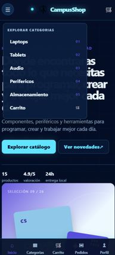             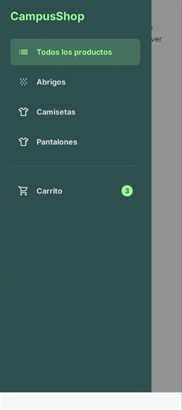 |
| Inicio                   | 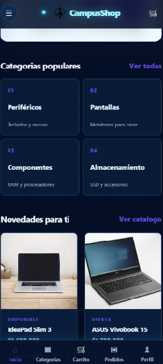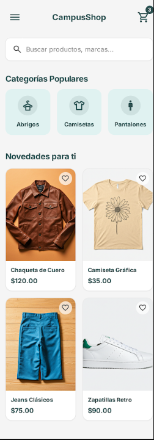                       |
| Catalogo                 | 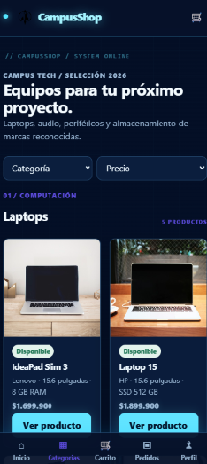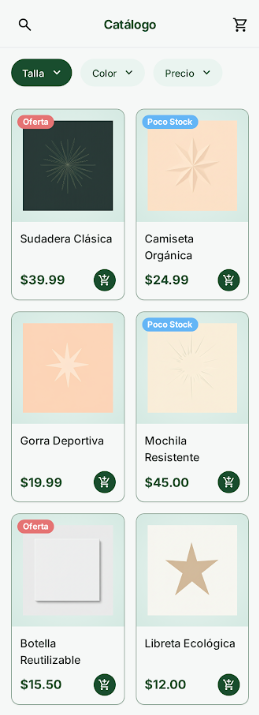                       |
| **Carrito**        | 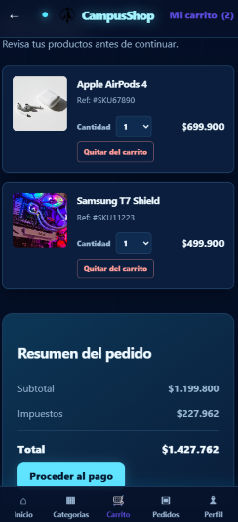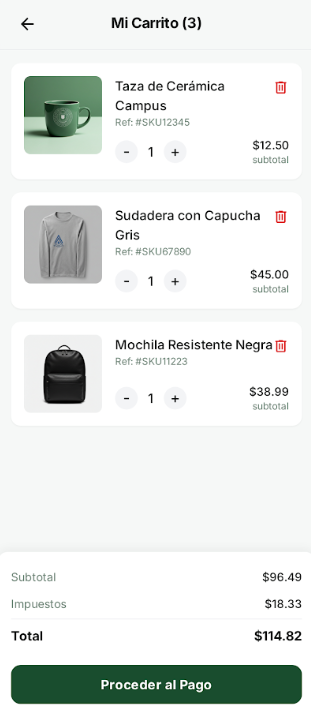                       |
| **Carrito vacío** | 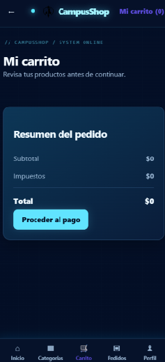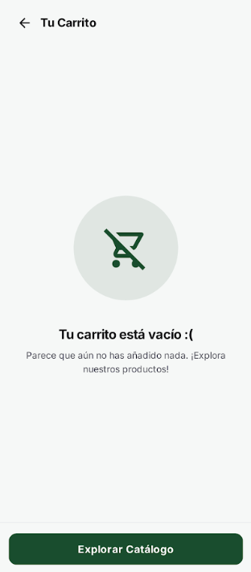                       |
| **Checkout**       | 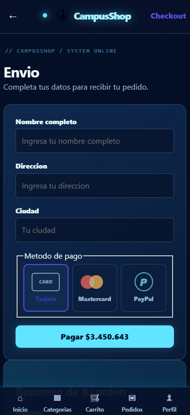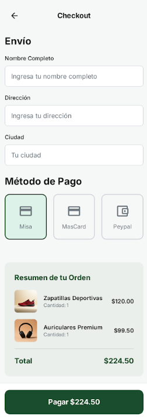                       |
| Pedidos                  | 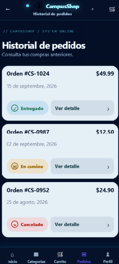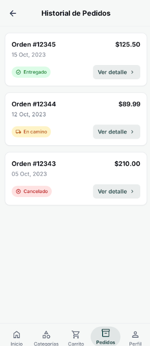                       |
| **Perfil**         | 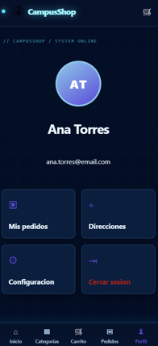     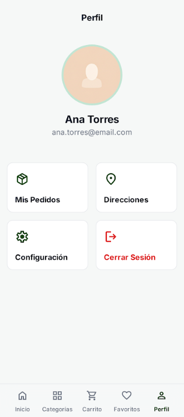               |
| Producto                 | 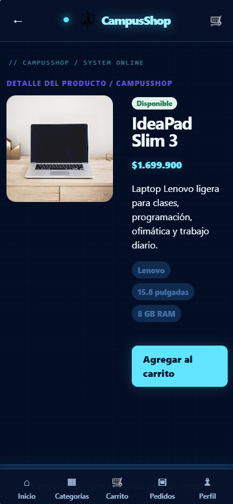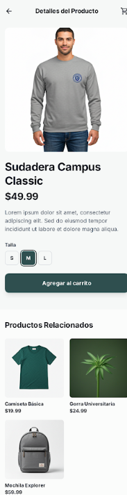                       |

---

## 👥 Equipo

Proyecto desarrollado como práctica de diseño de interfaz y experiencia de usuario para una tienda digital de tecnología.

| Integrante         | Rol                 |
| ------------------ | ------------------- |
| Cristian Uyaban    | Desarrollo frontend |
| Brayan Cristancho  | Desarrollo frontend |
| Alexander Castaño | Desarrollo frontend |

---

## 📄 Licencia

Este proyecto es de uso académico y de demostración.
